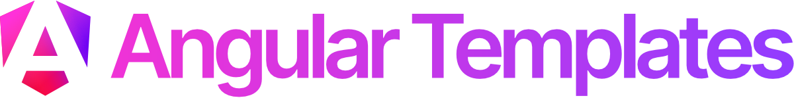

A set of simple Angular templates for popular and common web apps.

## Templates

- **AI Chatbot** – Simple chatbot app that supports multiple chats
- **AI Text Editor** – AI-powered editor that provides text enhancement tools and supports basic formatting
- **Dashboard** – Dashboard app with a set of configurable visualization widgets and data sources.
- **Ecommerce** – Basic Ecommerce app composed of a landing page, products list and details pages, and a cart
- **Image Gallery** – Optimized image gallery that supports image previews
- **Kanban** – Provides the well-known board UI accompanied by draggable cards

All app templates have an implemented state management and API layer, plus a mocked API for demonstration purposes.

## Run a template locally

After installing the NPM dependencies via `npm install`, you should build the shared code/library:

```shell
npm run shared:build
```

Then, you can simply choose a template that you want to run:

```shell
# Projects: ai-chatbot, ai-text-editor, dashboard, ecommerce, image-gallery, kanban
npm run <PROJECT>
```

### AI-powered templates

Some of the templates are using Gemini Developer API, i.e. those prefixed with `ai`. By default, they rely on a mocked output. However, if you want to test them directly with the real API, you should start `api/gemini.js` (`gemini:start-api`) and update the project's `app.config.ts` accordingly (there are instructions in the code). Keep in mind that you have to set your API key as the `API_KEY` environment variable prior to that.

## License

MIT
